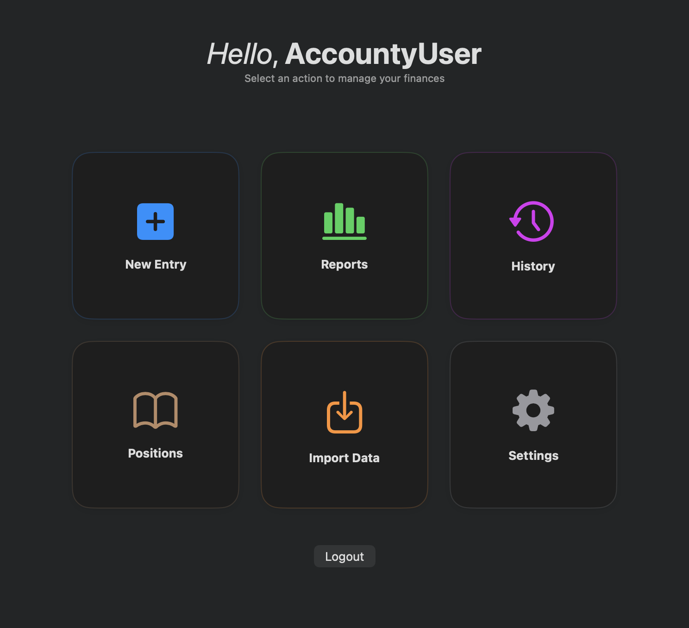
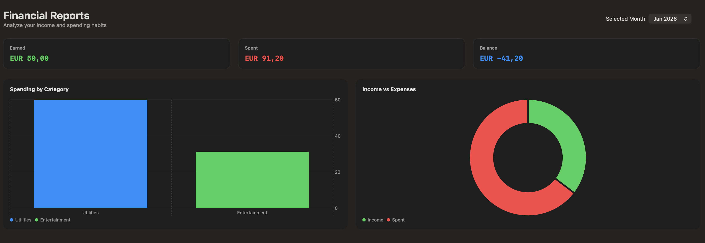

# Accounty

A macOS native expense tracker to manage and analyze one's assets and expenses.

> [!NOTE]
> The application still needs a lot more work.

## Showcase

After logging in, the user is welcomed with the following main menu:

  

And can take a peek, in the Reports menu, at the overall financial situation:

  

## Functionalities

Accounty allows the user to do the following:

- Inserting statements in the **New Entry** view, whether they are of the income or the expense type, and categorizing them;
- Accessing the **Reports** view to see an overview of the month's cashflow;
- Viewing the **History** of entries;
- Setting positions to have an overview of the NAV in **Positions**;
- **Import Data** from a csv file;
- Access the **Settings**, which is currently a placeholder.
